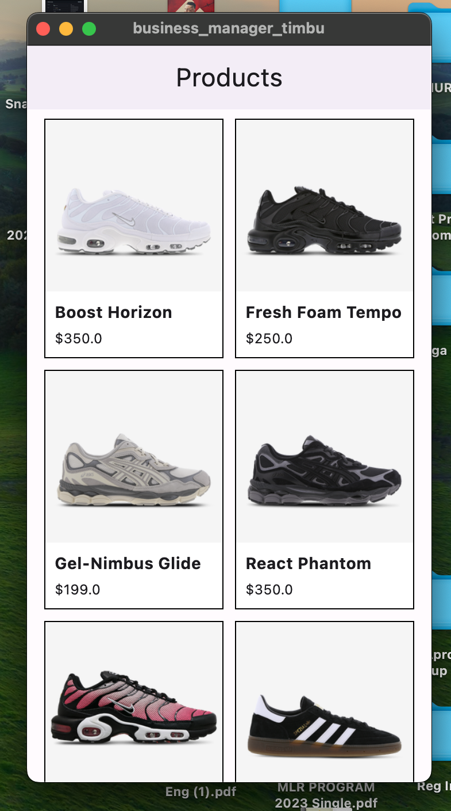

# Timbu Api App

A Flutter application that makes use of the timbu business api to display products.

## Features

- Product listing page

## Screenshots

### Product Page

1. Clone the repository:
   git clone https://github.com/adewuyito/timbu_product_app.git

2. Navigate to the project directory:
   cd timbu_app

3. Install dependencies:
   flutter pub

4. Run the app:
   flutter run

## Download

You can download the latest APK version of the app here: [Download APK](https://drive.google.com/file/d/1CwfqR7-HGWhK0CYTbO_P6b8x0iXWGXko/view?usp=share_link)

## Technologies Used

- Flutter
- Dart
